# Project 1: Identity & Access Management (Entra ID)

## What problem was I solving?

Most real world cloud breaches don't start with a firewall being hacked. They start with a stolen or over privileged login. So the question this project answers is simple: if someone gets a user's password, how do I make sure that's not enough to get into the system?

I built this in Microsoft Entra ID (Microsoft's identity platform, formerly called Azure AD), a small test environment with fake users and groups, to practice the controls that actually stop stolen credentials from turning into a full breach.

## What did I do?

### 1. Set up a starting point with users and groups

Before adding any security controls, I created a small test environment with 6 fake users and two groups, IT-admins and Finance-users, to mirror how a real company organizes people. This is the before state, a normal set of accounts with no extra protection yet.

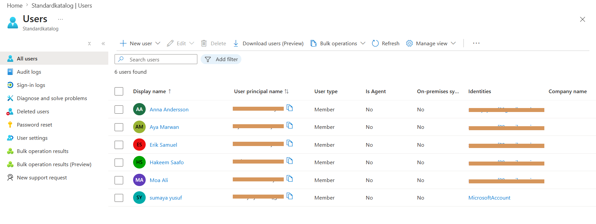
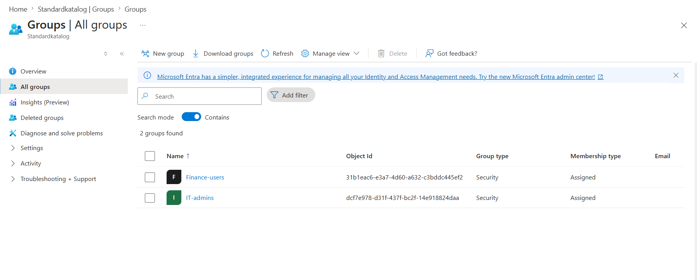

### 2. Required MFA for everyone

MFA, or multifactor authentication, means a password alone isn't enough to sign in. You also need to approve a prompt on your phone or enter a code. It's one of the single most effective things an organization can do, because it stops a stolen password from being usable on its own.

I built a policy called "Require MFA for all users" that applies to everyone signing into any app in the tenant, and set it so nobody gets in unless MFA is completed. I excluded my own admin account from the policy while testing. This is intentional and something you'd genuinely do in a real rollout, since you don't want to lock yourself out while you're still setting things up. Once I confirmed it worked as expected, I switched it fully on.

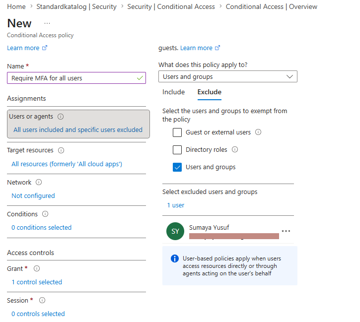
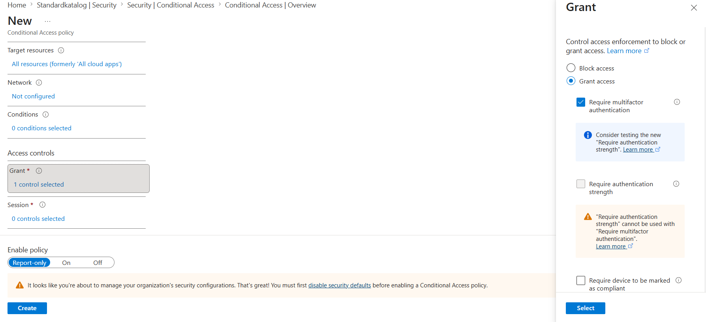
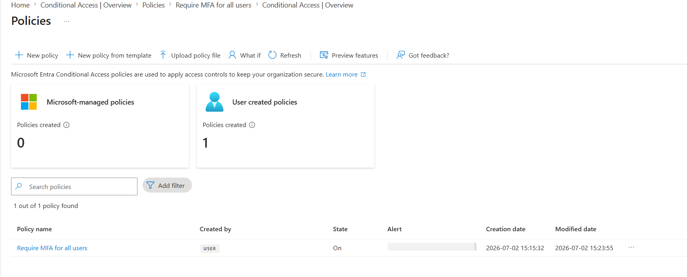

### 3. Blocked sign ins from outside Sweden and the EU

Next I added a second policy to block sign ins coming from outside Sweden and the EU. The idea is that if someone's stolen credentials get used from a country the company has no business in, the system blocks it automatically instead of relying on someone noticing later.

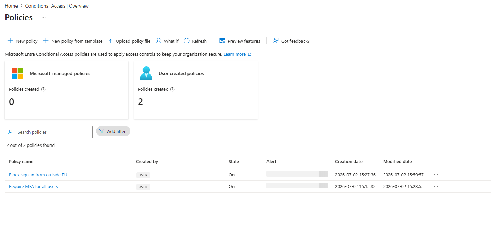

### 4. Tested the policies before trusting them

A policy that looks right in the settings screen isn't the same as a policy that actually works. So I used Entra's built in What If tool, which lets you simulate a sign in for a specific user, location, or app and see exactly which policies would kick in, without needing a real person to actually try signing in from another country.

For the first test, I simulated a sign in from an IP address in Brazil. Both policies correctly triggered. MFA was required, and the location based block also applied.

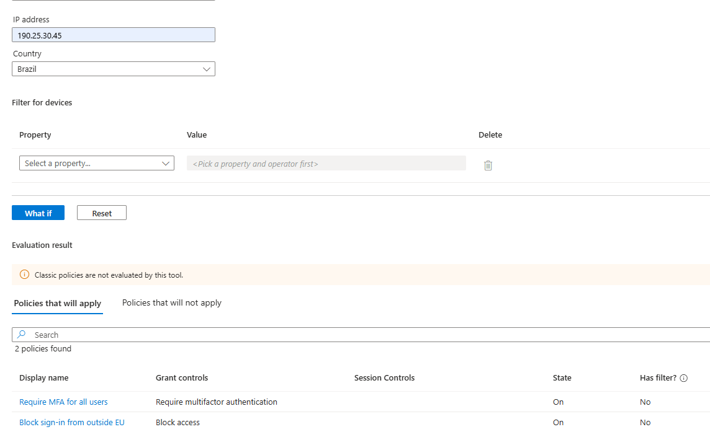

For the second test, I simulated a sign in for a specific user, Hakeem Saafo, on a specific device and app, to double check the policies were scoped correctly and not accidentally too broad or too narrow.

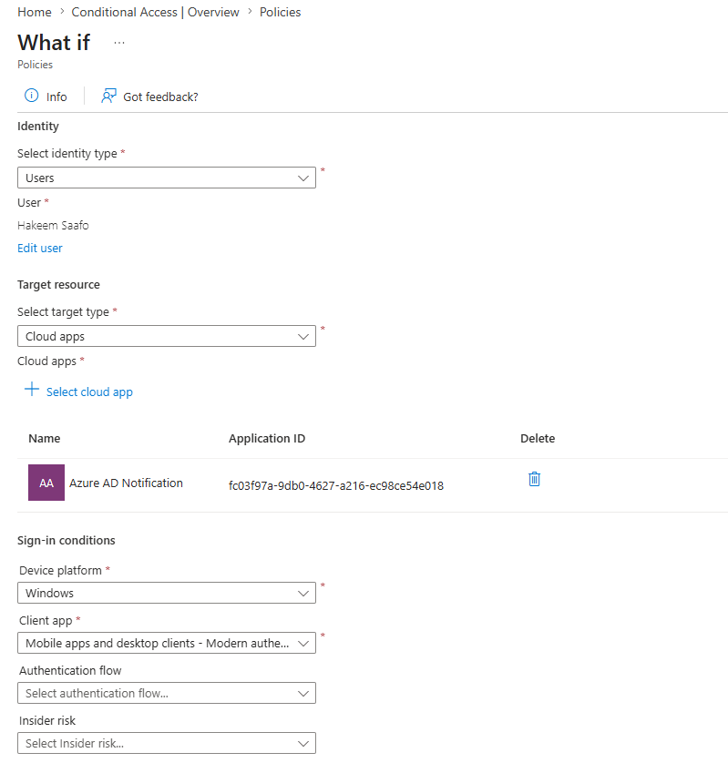

This step matters because it's the difference between saying I configured a policy and actually proving the policy does what I think it does, which is easy to skip and easy to get wrong.

### 5. Set up time limited admin access with PIM

Standing admin access, where someone always has elevated permissions whether they're using them or not, is a real risk. If that account gets compromised, the attacker instantly has admin rights too.

Instead I used Privileged Identity Management, or PIM, to set up the IT-admins group so nobody holds the Security Reader role permanently. They have to request the role and explain why they need it, get that request approved by someone else, and only then get the role activated, and only for a limited window of up to eight hours, after which it automatically expires.

I configured the role settings first.

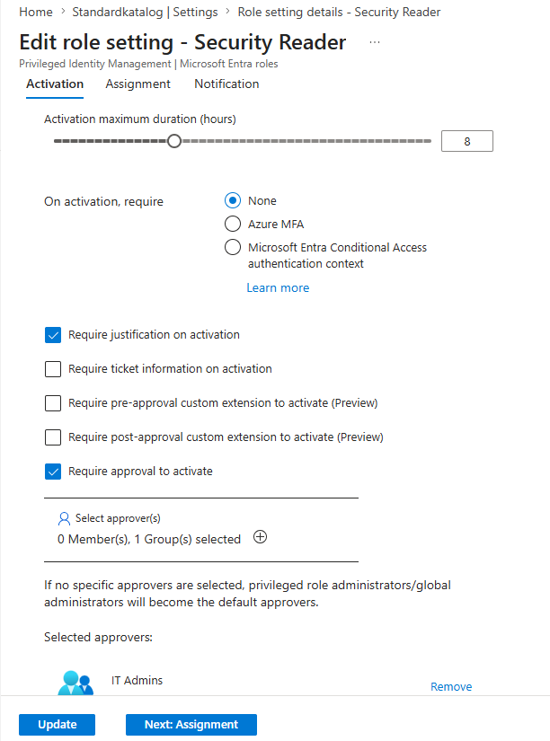
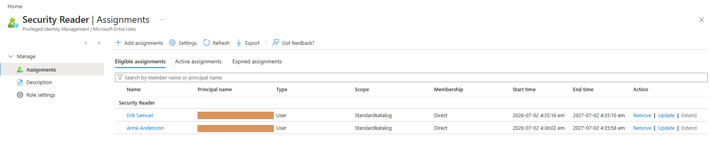

Then I walked through the actual request from start to finish. A user, Sara Farah, requested the role with a real justification, investigating Conditional Access and sign in logs following a suspicious sign in report, which is the kind of reason a SOC analyst would genuinely write during an investigation.

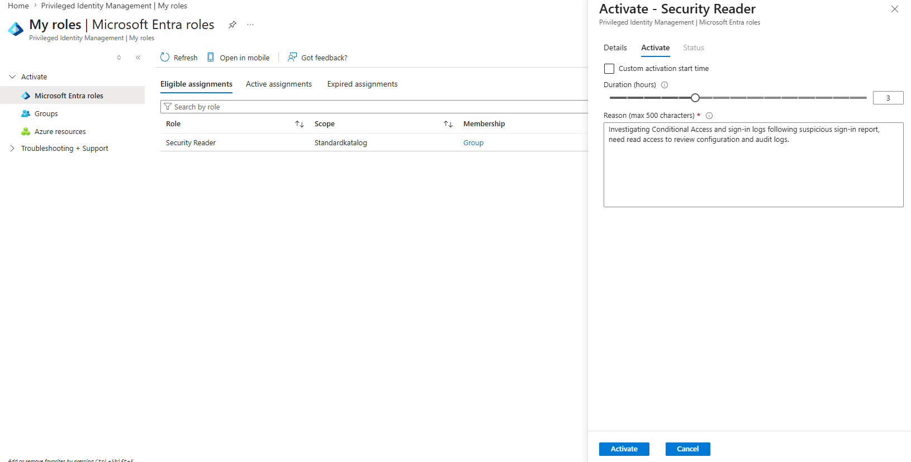

The request landed in an approval queue and was approved.

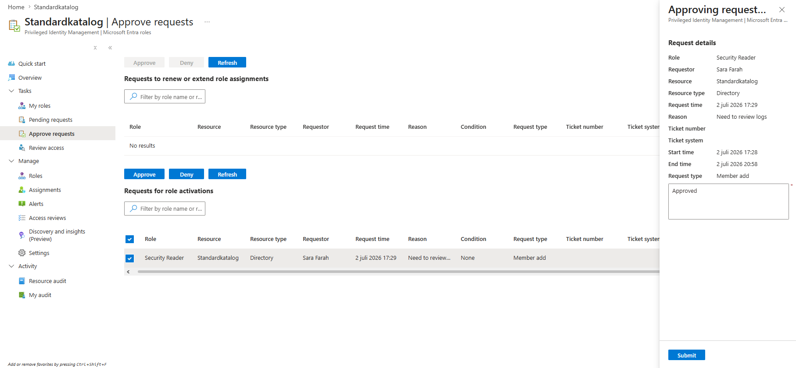

Only after approval did the role actually become active, with a start and end time attached.

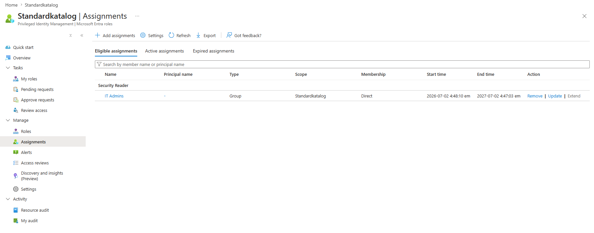

### 6. Simulated an employee leaving the company

Access doesn't just need to be granted correctly. It needs to be removed correctly too, and quickly, when someone leaves. I simulated one of my test users, Moa Ali, leaving the company and being offboarded.

Before offboarding, Moa Ali was still an active member of the Finance-users group, with normal access.

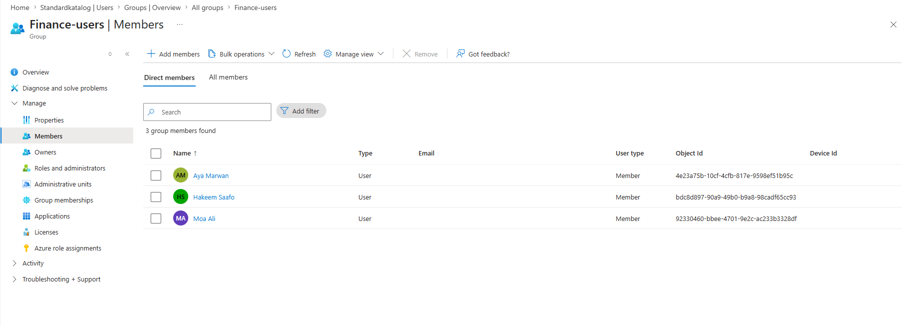

The first step was to disable sign in immediately. This is the fastest way to stop someone from accessing anything, even before there's been time to clean up every group and permission they had. It also doesn't delete their account or mailbox, which matters if the company still needs to review old files or emails during the handover.

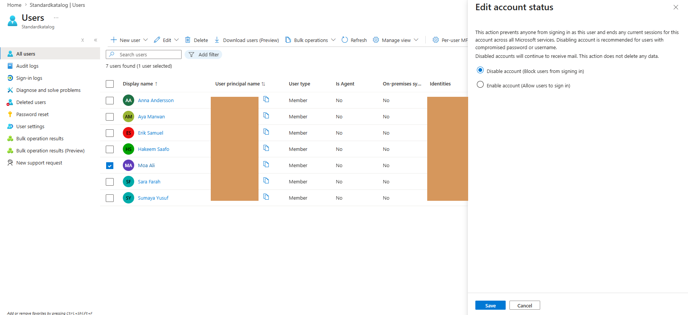
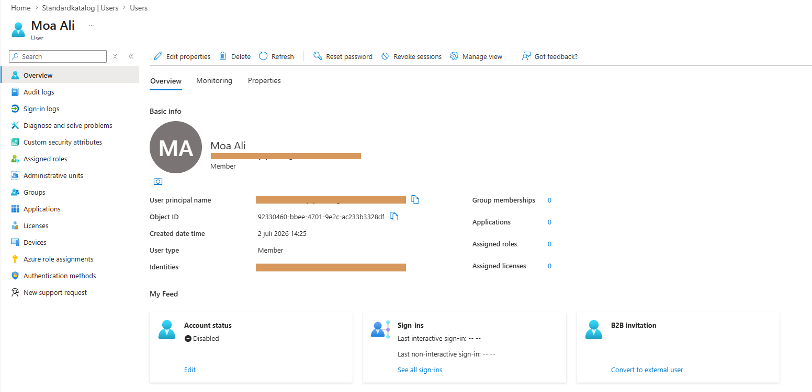

The second step was removing them from their groups. Once sign in was blocked, I removed Moa Ali from Finance-users, which strips the access tied to that role.

Afterward, the group only shows the two people who should still have access.

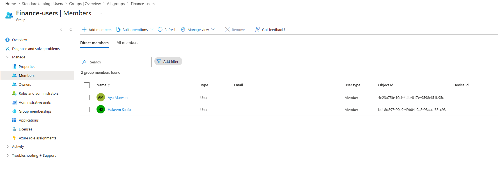

In a real company, this whole sequence would usually be triggered automatically the moment HR marks someone as terminated, rather than someone manually clicking through it. What I did here shows the actual mechanics of what that automation would be performing behind the scenes.

## What skill does this prove?

This project shows Conditional Access policy design, including building rules that require MFA and restrict access by location. It shows testing before trusting, using the What If tool to verify policies actually behave as intended instead of just assuming they do. It shows least privilege thinking through PIM, where nobody holds standing admin rights and access has to be requested, justified, approved, and time limited. And it shows an understanding of offboarding, disabling access immediately and removing group membership in the right order.

## How does this apply in a real SOC or security team?

This is, in plain terms, the work of stopping a stolen password from becoming a full breach. Most attackers don't need to hack their way in, they just need one set of working credentials. A missing MFA policy, a permanent admin account, or a leaver who never got properly offboarded are exactly the kind of gaps that show up in breach reports afterward. Getting these basics right, and being able to prove they work rather than just assuming they're configured, is a big part of what keeps an organization off that list.

## Policy to threat mapping

| Control | Threat it mitigates |
|---|---|
| Require MFA for all users | Stolen or guessed passwords being enough on their own to log in |
| Block sign in from outside EU | Credentials being used from a country the company has no legitimate reason to sign in from |
| PIM for admin access | A compromised account automatically having standing admin rights |
| Offboarding process | Former employees retaining access after they've left |

## Notes on what was tested versus simulated

The MFA and location policies were both set to Report only first, checked, and then switched to fully On. This mirrors how a real company would roll out a policy, so people don't get locked out by accident. I don't have a way to genuinely fake my location from another country, so the location block policy was validated using the What If simulation tool rather than a real sign in attempt from abroad, and that's stated here plainly rather than implied to be a live test. This was all built in a personal Entra ID test tenant for learning purposes, not a production environment. Some screenshot fields, like usernames, are partially blurred for privacy.
